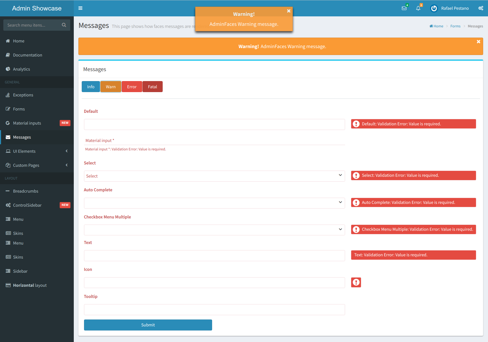

= Admin Theme
:page-layout: base
:toc: preamble
:source-language: java
:icons: font
:linkattrs:
:sectanchors:
:sectlink:
:numbered:
:doctype: book
:tip-caption: :bulb:
:note-caption: :information_source:
:important-caption: :heavy_exclamation_mark:
:caution-caption: :fire:
:warning-caption: :warning:

[quote]
____
A PrimeFaces theme to rule them all!
____

image:https://travis-ci.org/adminfaces/admin-theme.svg[Build Status (Travis CI), link=https://travis-ci.org/adminfaces/admin-theme]
image:https://maven-badges.herokuapp.com/maven-central/com.github.adminfaces/admin-theme/badge.svg["Maven Central",link="http://search.maven.org/#search|ga|1|admin-theme"]
image:https://badges.gitter.im/Join%20Chat.svg[link="https://gitter.im/adminfaces?utm_source=badge&utm_medium=badge&utm_campaign=pr-badge&utm_content=badge"]

This project is a http://primefaces.org/themes[Primefaces^] `admin` theme based on https://almsaeedstudio.com/themes/AdminLTE/index2.html[Admin LTE^] and http://getbootstrap.com[Bootstrap^].

== Introduction

This theme is a css file containing Admin LTE and Bootstrap as well as customized Primefaces components to make them look like AdminLTE and Bootstrap.

== Usage

. Just add it to your application classpath:
+
[source,xml]
----
<dependency>
    <groupId>com.github.adminfaces</groupId>
    <artifactId>admin-theme</artifactId>
    <version>1.0.0-RC18</version>
<!--<classifier>dev</classifier> uncompressed theme.css-->
</dependency>
----
+
. Add this context-param in your web.xml:

----
<context-param>
    <param-name>primefaces.THEME</param-name>
    <param-value>admin</param-value>
</context-param>
----

TIP: If you use https://github.com/adminfaces/admin-template[Admin Template^] there is no need to add this project to your classpath neither the web.xml entry.

== Architecture

The theme uses http://lesscss.org/[less^] as css pre-processor. Each PrimeFaces component has its own less file:

.src/main/resources/less
----
├── admin-lte
│    |
│    ├── bootstrap <1>
│    │
│    ├── skins <2>
│    │
│    └── admin lte less files
│
├── primefaces-admin
│    |
│    ├─ components <3>
│    │   |
│    │   ├── accordeon.less
│    │   │
│    │   ├── autocomplete.less
│    │   │
│    │   └── etc...
│    │
│    ├─ theme.less <4>
│    │
     └─ variables.less
----
<1> Bootstrap variables and https://css-tricks.com/snippets/css/useful-css3-less-mixins/[mixins^] are used as reference in AdminLTE and admin theme less files
<2> Built in skins
<3> PrimeFaces components
<4> Components and Admin-LTE less files are included in theme.less

After compilation it will generate the theme.css with Admin-LTE, Bootstrap and Primefaces components.

NOTE: Bootstrap.css (from src/META-INF/resources) is included in theme.less but can be removed via maven classifiers

NOTE: Bootstrap less is not maintained in this project only it's mixins.

== Theme classifiers

This project uses http://stackoverflow.com/questions/20909634/what-is-the-purpose-of-classifier-tag-in-maven[maven classifiers^] to offer multiple `faces` (pum intended) of Admin Theme. Below is the description of each classifier and how to use it.

=== Default (no classifier)
The default theme comes `compressed`, with `Bootstrap (3.3.7)` embedded and uses `JSF resource handling` for loading images and web fonts.

.Maven usage
[source,xml]
----
<dependency>
    <groupId>com.github.adminfaces</groupId>
    <artifactId>admin-theme</artifactId>
    <version>1.0.0-RC18</version>
</dependency>
----

=== Dev classifier

The `dev` classifier will bring a theme.css *without minification*.

.Maven usage
[source,xml]
----
<dependency>
    <groupId>com.github.adminfaces</groupId>
    <artifactId>admin-theme</artifactId>
    <version>1.0.0-RC18</version>
    <classifier>dev</classifier>
</dependency>
----

=== Without Bootstrap classifier

The `without-bootstrap` classifier will bring a theme.css *without bootstrap embedded* so it's up to the developer to provide Bootstrap within the application.

.Maven usage
[source,xml]
----
<dependency>
    <groupId>com.github.adminfaces</groupId>
    <artifactId>admin-theme</artifactId>
    <version>1.0.0-RC18</version>
    <classifier>without-bootstrap</classifier>
</dependency>
----

=== Without JSF classifier

The `without-jsf` classifier will bring a theme.css *without JSF resource handling* so the theme can be used on projects (derived from PrimeFaces) without JSF like Prime React, PrimeUI or PrimeNG.

.Maven usage
[source,xml]
----
<dependency>
    <groupId>com.github.adminfaces</groupId>
    <artifactId>admin-theme</artifactId>
    <version>1.0.0-RC18</version>
    <classifier>without-jsf</classifier>
</dependency>
----

=== No Fonts classifier

Since `v1.0.0-RC16` web fonts such as `glyphicons` and `Source Sans Pro` are embedded inside the theme instead of being queried from a https://en.wikipedia.org/wiki/Content_delivery_network[CDN^]. 

This makes the theme work offline or in environments with limited access to the internet but on the other hand results in a larger jar file, `~1MB` against `~200kb` when fonts are not in the theme.

So if you want a thinner theme you can use the *no-fonts* classifier:

[source,xml]
----
<dependency>
    <groupId>com.github.adminfaces</groupId>
    <artifactId>admin-theme</artifactId>
    <version>1.0.0-RC18</version>
    <classifier>no-fonts</classifier>
</dependency>
----

== Avoiding theme caching

Whenever the theme is updated to a new version in the project users may have to clear their browser caches to get the changes of the new theme.
Sometimes a theme update even introduces conflicts and only clearing browser cache fixes them.

To solve this issues you can use a theme classifier called *no-cache*:

.pom.xml
[source,xml]
----
<dependency>
    <groupId>com.github.adminfaces</groupId>
    <artifactId>admin-theme</artifactId>
    <version>1.0.0-RC18</version>
    <classifier>no-cache</classifier>
</dependency>
----

This classifier *appends the theme version* to the name of theme so you need to *change the theme name* in `web.xml`:

.web.xml
[source,xml]
----
<context-param>
    <param-name>primefaces.THEME</param-name>
    <param-value>admin-1.0.0-RC18</param-value>
</context-param>
----

TIP: There is also a `no-cache-no-fonts` classifier combining both approaches.

== Development

To get your hands dirty with admin theme it is recommended to use http://github.com/adminfaces/admin-designer[Admin Designer^] in combination with http://brackets.io/[Brackets] or any tool that `compile less` files to css on save.

Using designer, which is backed by http://wildfly-swarm.io/[Wildfly Swarm^], plus brackets will let you change the components less files and see the results instantly.

NOTE: theme.less is already brackets aware so you just need to change any component less file, save it and see the results in Admin Designer.

== Demo

See https://github.com/adminfaces/admin-showcase[Admin Showcase^].

== Snapshot

Snapshots are published to https://oss.sonatype.org/content/repositories/snapshots/com/github/adminfaces/[maven central^] on each commit, to use it just declare the repository below on your `pom.xml`:

[source,xml]
----
<repositories>
    <repository>
        <snapshots/>
        <id>snapshots</id>
        <name>libs-snapshot</name>
        <url>https://oss.sonatype.org/content/repositories/snapshots</url>
    </repository>
</repositories>
----
